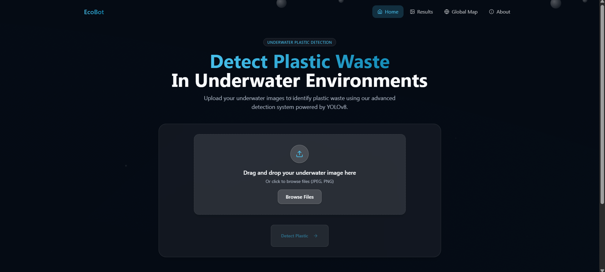
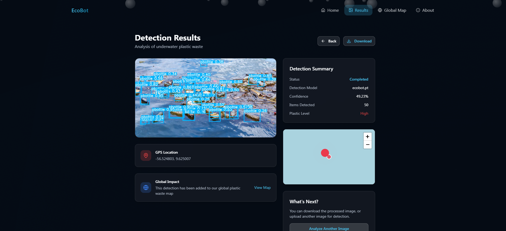
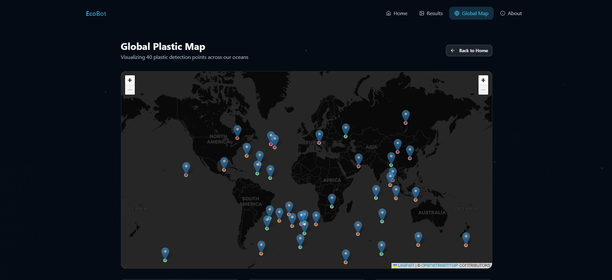

# 🌊 EcoBot – Underwater Plastic Waste Detection

[](LICENSE)  
EcoBot is an AI-powered web application for detecting and visualizing plastic waste in underwater environments. Built with **YOLOv8**, it enables real-time analysis of underwater images and helps raise awareness about ocean pollution. 🌱

[Live Demo 🚀](https://github.com/chetlasrijith/eco-bot) | [Report Issues 🛠️](https://github.com/chetlasrijith/eco-bot/issues)

---

## 📸 Screenshots

### 🌱 Home Page
Upload underwater images to detect plastic waste using our advanced detection system.  


---

### 🧪 Detection Results
View detailed detection results, including confidence scores, plastic level, and global impact.  


---

### 🗺️ Global Plastic Map
Visualize plastic detection points around the globe.  


---

## 🚀 Features

✅ Detect plastic waste in underwater images using YOLOv8  
✅ Summarize detections with confidence scores & plastic level  
✅ Visualize detection locations on a global map (powered by Leaflet)  
✅ Download processed images with annotations  
✅ Responsive web UI for easy access on any device  

---

## 🛠️ Tech Stack

- **Frontend**: HTML, CSS, JavaScript (Tailwind CSS, React.js)  
- **Backend**: Python (FastAPI / Flask)  
- **Deep Learning**: YOLOv8 (Ultralytics)  
- **Mapping**: Leaflet.js, OpenStreetMap  
- **Deployment**: Docker, AWS EC2  

---

## 📥 Installation

### Clone the repository
```bash
git clone https://github.com/chetlasrijith/eco-bot.git
cd eco-bot
````

### Install dependencies

```bash
pip install -r requirements.txt
```

### Run the application

```bash
python app.py
```

Then open your browser and go to `http://127.0.0.1:8000`

---

## 🧑‍💻 How It Works

1. **Image Upload**: Users upload underwater images via the web interface.
2. **Preprocessing**: Images are resized and normalized.
3. **Detection**: YOLOv8 model detects plastic objects and classifies them (e.g., bottles, bags).
4. **Visualization**: Detected objects are highlighted and their coordinates mapped globally.
5. **Download Option**: Users can download annotated images or view results on the global map.

---

## 🤝 Contributing

Contributions are welcome! Please follow these steps:

1. Fork the repo
2. Create your branch (`git checkout -b feature/new-feature`)
3. Commit your changes (`git commit -m 'Add new feature'`)
4. Push to the branch (`git push origin feature/new-feature`)
5. Open a Pull Request

---

## 📞 Contact

Created by [Chetla Srijith](https://github.com/chetlasrijith)
For queries, raise an issue in the repository or connect on [LinkedIn](https://www.linkedin.com/in/srijithchetla/).

---
